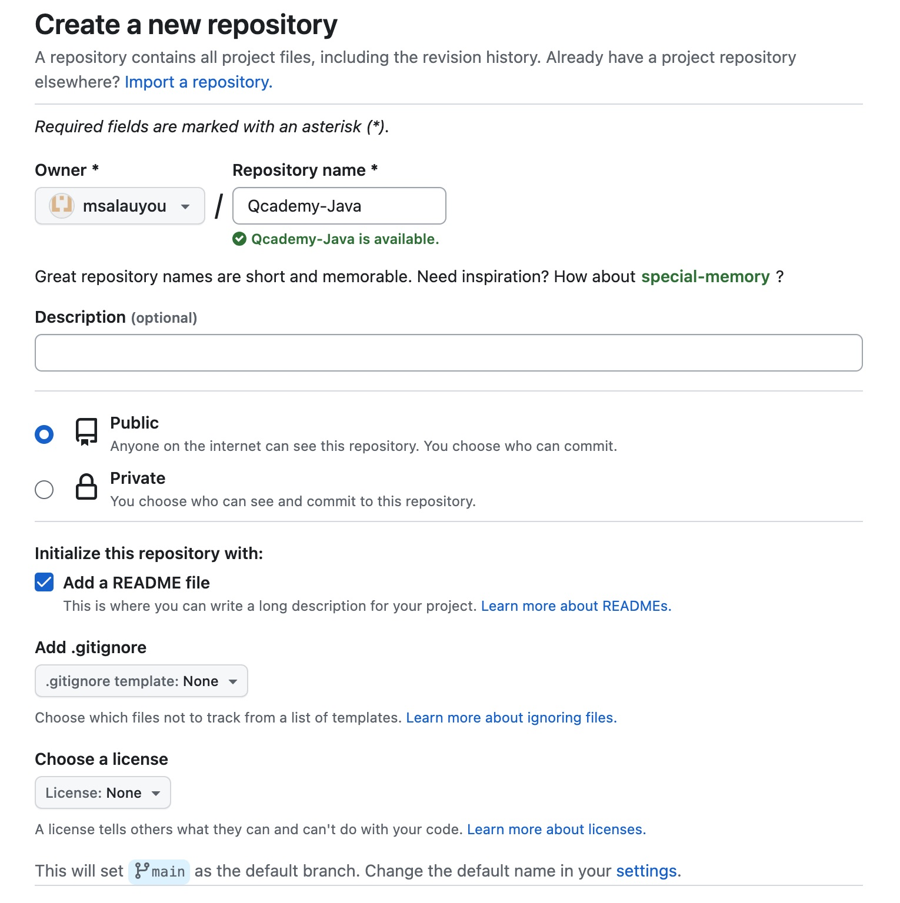
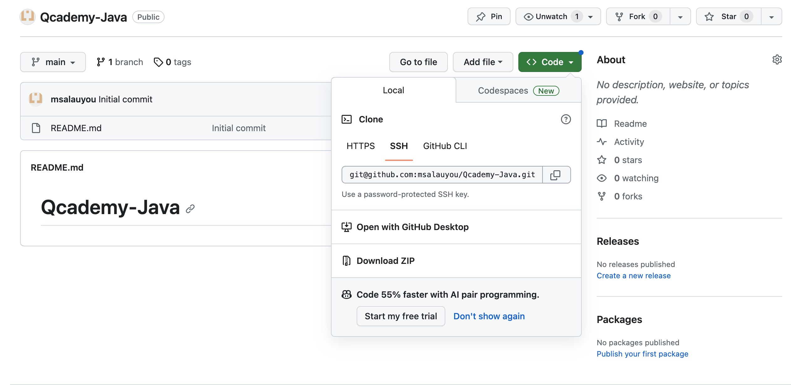
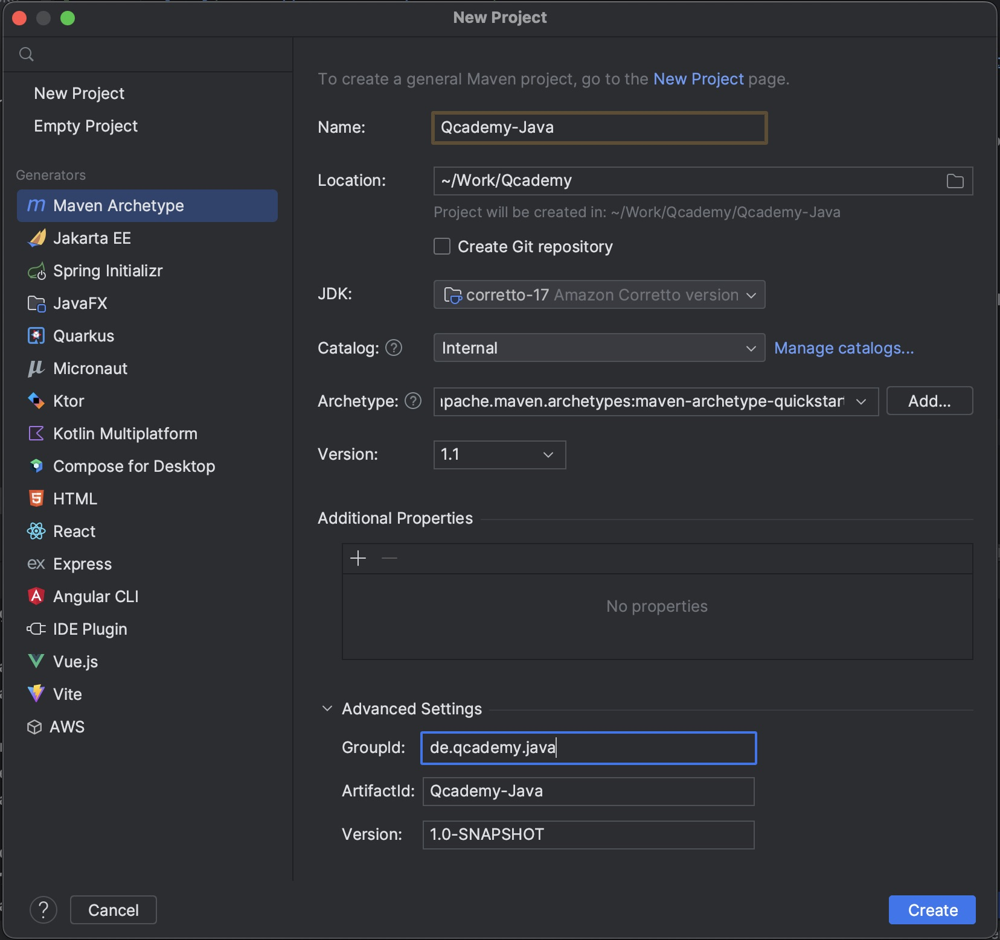
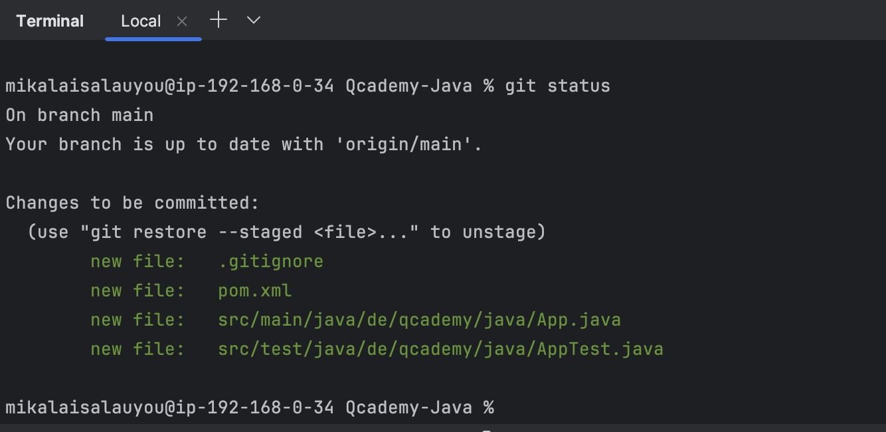

# Umgebungsvorbereitung
Nachfolgend finden Sie eine detaillierte Anleitung zum Einrichten Ihrer Startumgebung, die Ihnen dabei hilft, 
Ihre Java-Hausaufgaben effizienter zu erledigen.

## Github-Vorbereitung
1. Erstellen Sie ein neues Repository in [GitHub](https://github.com/), nennen wir es `Qcademy-Java`;
   <details>
      <summary><i>See picture for details</i></summary>
      
   </details>

2. Kopieren Sie eine Git-Repository-URL, siehe Bild:
   <details>
      <summary>See picture for details</summary>
      
   </details>
3. Öffnen Sie ein Command line tool auf dem lokalen Computer;
4. Wählen Sie einen Ordner (Verzeichnis) aus, in dem Sie Ihre Home-Aufgaben speichern möchten, und führen Sie den folgenden Befehl aus:
   ```shell
   git clone git@github.com:msalauyou/Qcademy-Java.git
   ```
5. Stellen Sie sicher, dass sich auf Ihrem Computer der Ordner `Qcademy-Java` befindet;
   Jetzt haben wir einen Ordner, in dem wir alle unsere Java-Hausaufgaben aufbewahren können. Jetzt müssen wir ein Projekt in Intellij IDEA erstellen.

## Projekt in Intellij IDEA Erstellung
1. Öffnen Sie **Intellij IDEA** und erstellen Sie ein neues Maven-Projekt:
   <details>
      <summary>See picture for details</summary>
      
   </details>
2. Stellen Sie sicher, dass Ihr `.gitignore` den folgenden Inhalt hat:
   ```gitignore
   .idea/
   /target/
   ```
3. Jetzt können wir unsere Änderungen im `Staging area` hinzufügen:
   ```shell
   git add pom.xml
   git add .gitignore
   git add src/main/java/de/qcademy/java/App.java
   git add src/test/java/de/qcademy/java/AppTest.java
   ```
4. Überprüfen Sie den Git-Status:
   ```shell
   git status
   ```
   Stellen Sie sicher, dass Sie keine Dateien von `.gitignore` übertragen.
   <details>
      <summary>See picture for details</summary>
      
   </details>
5. Commit alle Änderungen:
   ```shell
   git commit -m "Prepare a java homework directory"
   ```
6. Push alle Änderungen:
   ```shell
   git push origin main
   ```

Daher haben wir ein Repository für unsere zukünftige Java-Hausaufgabenimplementierung vorbereitet. Also, wir können beginnen.