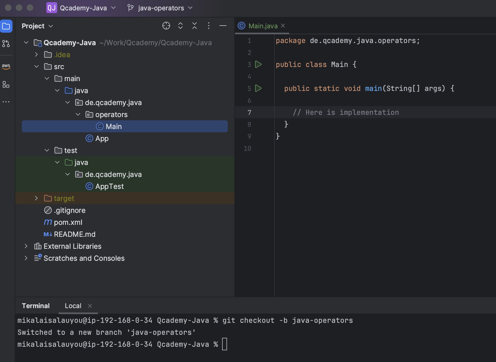
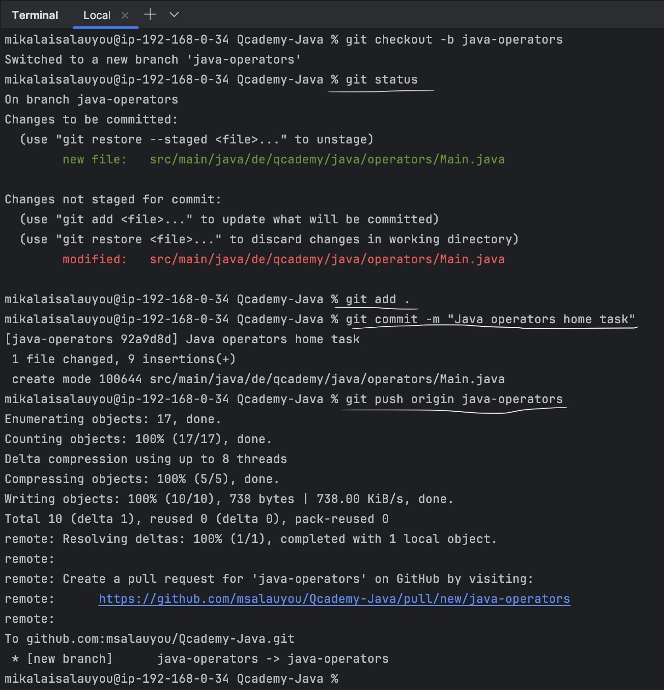
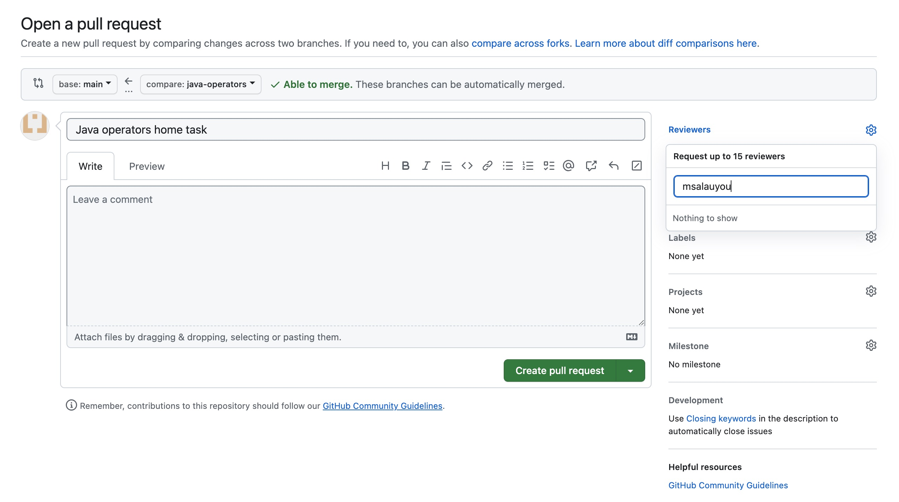
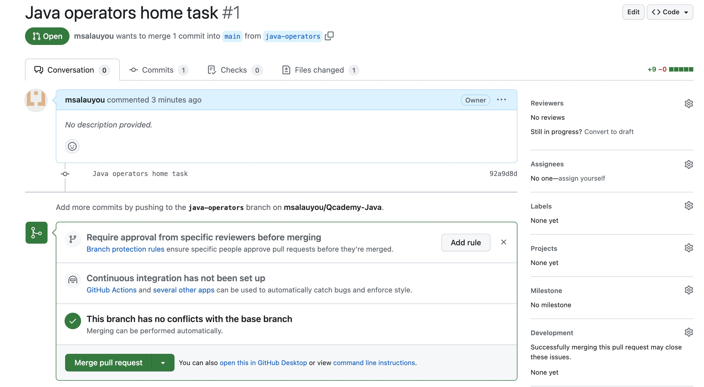

## Pull-Request-Anweisung

Die Implementierung jeder Home-Aufgabe sollte als separate Pull-Anfrage (PR) bereitgestellt werden. 
Nachfolgend finden Sie eine detaillierte Anleitung zum Erstellen von PR, die Sie Ihrem Trainer mitteilen können.

Nachdem Sie alle Schritte der Anleitung [Umgebungsvorbereitung](docs/INITIAL_SETUP.md) abgeschlossen haben, können wir beginnen
Umsetzung unserer Hausaufgaben. So lass uns anfangen:
1. Erstellen Sie einen neuen Git-Branch. Der Name sollte den Namen der Aufgabe widerspiegeln, z. B.:
```shell
git checkout -b java-operators
```
2. Erstellen Sie in Ihrem Intellij IDEA-Projekt ein neues Paket mit einem Namen, der das Thema der Aufgabe widerspiegelt.
In diesem Paket können Sie eine neue Klasse erstellen (es kann `Main.java` sein), in der Sie Ihre Aufgabe implementieren, z. B.:
    <details>
        <summary><i>Weitere Informationen finden Sie im Bild</i></summary>
        
    </details>
3. Es wäre sehr schön, wenn Sie oberhalb Ihres Codes eine Aufgabenbeschreibung als Kommentar einfügen würden;
4. Wenn Ihre Aufgabe fertig ist und Sie sie dem Coach zeigen möchten, müssen Sie alle Änderungen in das Remote-Repository 
übertragen (vergessen Sie nicht, Ihren Code zu formatieren und zu überprüfen, ob er der [code convention](CODE_CONVENTION.md) 
entspricht).
Bitte führen Sie die folgenden Befehle aus:
```shell
git add . 
git commit -m "Java operators home task"
git push origin java-operators
```
5. Wenn alles korrekt war, sehen Sie den Link zum Erstellen einer neuen PR, siehe unten:
    <details>
       <summary><i>Weitere Informationen finden Sie im Bild</i></summary>
       
    </details>
6. Folgen Sie diesem Link, erstellen Sie eine neue PR und weisen Sie den Trainer als Prüfer zu (z. B. msalauyou):
    <details>
       <summary><i>Weitere Informationen finden Sie im Bild</i></summary>
       
    </details>
7. Wenn Sie keinen Trainer als Rezensent hinzufügen können, müssen Sie ihn/sie als Mitarbeiter einladen. 
Bitte lesen Sie die [Anleitung](https://docs.github.com/en/account-and-profile/setting-up-and-managing-your-personal-account-on-github/managing-access-to-your-personal-repositories/inviting-collaborators-to-a-personal-repository).
Stellen Sie sicher, dass der Coach Ihre Einladung annimmt, dann können Sie ihn/sie zur Überprüfung zuweisen;
8. Bitte fügen Sie einen Link zur PR zu den entsprechenden US in Trello hinzu;
9. Der Coach überprüft die Aufgabe und hinterlässt Kommentare. Sie sollten alle Anmerkungen korrigieren 
und in das Remote-Repository übertragen, damit Coach es erneut überprüfen kann. Wenn Sie den Code lokal korrigiert haben, 
führen Sie bitte die folgenden Befehle aus:
```shell
git add .
git commit -m "Fix code review issues"
git push origin java-operators
```
10. Wenn die Codeüberprüfung erfolgreich war, wird sie vom Trainer genehmigt. Nach der Genehmigung können 
Sie den Code mit Ihrem `main` Branch zusammenführen, indem Sie auf die Schaltfläche `Merge pull request` klicken:
    <details>
       <summary><i>Weitere Informationen finden Sie im Bild</i></summary>
       
    </details>
11. Nachdem der Code zusammengeführt wurde, können Sie eine neue Aufgabe starten. Vergessen Sie jedoch nicht, 
zum `main` Branch zu wechseln und alle Ihre Änderungen zu übernehmen:
```shell
git checkout main
git pull
```
Nach diesen Aktionen übertragen Sie alle Ihre Merge-Remote-Änderungen in das lokale Repository, sodass 
Sie bereit sind, mit der neuen Aufgabe zu beginnen (für neue Aufgaben können Sie denselben Anweisungen folgen).